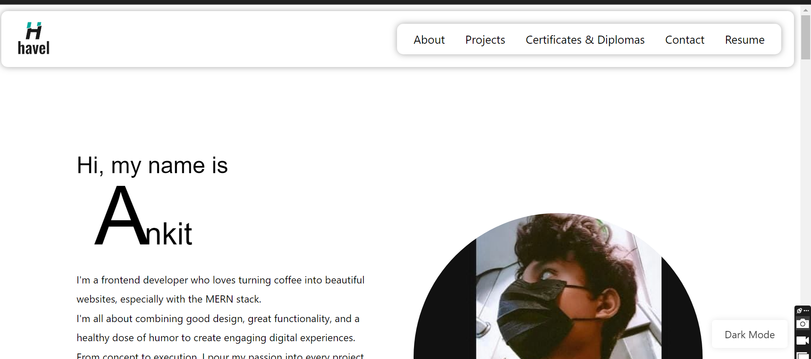

#site is live click here (https://ankitthakur1.netlify.app/)


# Portfolio Website

Welcome to my portfolio website! This project showcases my skills and projects using JavaScript, CSS, React, Tailwind CSS, Git, and Node.js.



## 🚀 Getting Started

Get your own copy of the project up and running on your local machine in minutes!

### Prerequisites

Make sure you have Node.js and npm (Node Package Manager) installed on your machine. You can download and install them from [here](https://nodejs.org/).

### Tech Stack

Here are the technologies used in this project:

<div align="center">


[](https://github.com/thakurankit012/portfolio)
[](https://github.com/thakurankit012/portfolio)


  
  
</div>

### Installation

1. **Clone the repository** to your local machine:

```bash
git clone https://github.com/your-username/portfolio-website.git
```

2. **Navigate to the project directory**:

```bash
cd portfolio-website
```

3. **Install dependencies** using npm:

```bash
npm install
```

## 💻 Running the Website

To run the website locally, use the following command:

```bash
npm start
```

want to make your portfolio just download the project and edit as per your details 
my portfolio project is in progress ....

